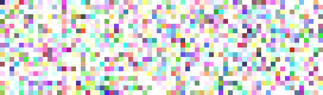
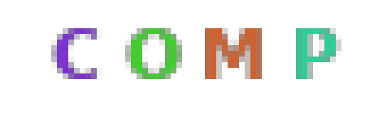
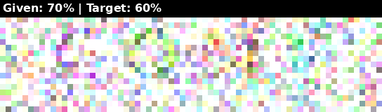
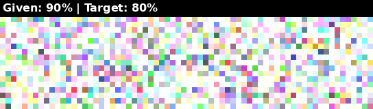
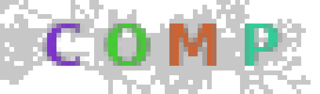
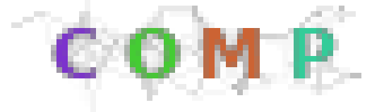

# NCA Experiments Dashboard

This dashboard is automatically updated by the background jobs.

## Experiment: `snaps_9_line`
**Latest Loss**: N/A

**Latest Output**:

---
## Experiment: `snaps_9_line_noise`
**Latest Loss**: N/A

**Latest Output**:

---
## Experiment: `snaps_adaptive_cloud`
**Latest Loss**: N/A

**Latest Output**:

---
## Experiment: `snaps_backup`
**Latest Loss**: N/A

---
## Experiment: `snaps_cloud`
**Latest Loss**: N/A

**Latest Output**:

---
## Experiment: `snaps_comp`
**Latest Loss**: N/A

**Latest Output**:

---
## Experiment: `snaps_debug`
**Latest Loss**: N/A

**Latest Output**:

---
## Experiment: `snaps_debug2`
**Latest Loss**: N/A

**Latest Output**:

---
## Experiment: `snaps_diffusion`
**Latest Loss**: N/A

**Latest Output**:

---
## Experiment: `snaps_diffusion_16k`
**Latest Loss**: 0.02350049465894699

**Latest Output**:

---
## Experiment: `snaps_dyn_clear_n1`
**Latest Loss**: N/A

**Latest Output**:

---
## Experiment: `snaps_dyn_clear_n100`
**Latest Loss**: N/A

**Latest Output**:

---
## Experiment: `snaps_dyn_clear_n1000_vol0_1`
**Latest Loss**: N/A

**Latest Output**:

---
## Experiment: `snaps_dyn_clear_n1000_vol0_4`
**Latest Loss**: N/A

**Latest Output**:

---
## Experiment: `snaps_dyn_clear_n1000_vol0_7`
**Latest Loss**: N/A

**Latest Output**:

---
## Experiment: `snaps_dyn_clear_n100_vol0_1`
**Latest Loss**: N/A

**Latest Output**:

---
## Experiment: `snaps_dyn_clear_n100_vol0_4`
**Latest Loss**: N/A

**Latest Output**:

---
## Experiment: `snaps_dyn_clear_n100_vol0_7`
**Latest Loss**: N/A

**Latest Output**:

---
## Experiment: `snaps_dyn_clear_n1_vol0_1`
**Latest Loss**: N/A

**Latest Output**:

---
## Experiment: `snaps_dyn_clear_n1_vol0_4`
**Latest Loss**: N/A

**Latest Output**:

---
## Experiment: `snaps_dyn_clear_n1_vol0_7`
**Latest Loss**: N/A

**Latest Output**:

---
## Experiment: `snaps_dyn_clear_n500`
**Latest Loss**: N/A

**Latest Output**:

---
## Experiment: `snaps_dyn_clear_n500_vol0_1`
**Latest Loss**: N/A

**Latest Output**:

---
## Experiment: `snaps_dyn_clear_n500_vol0_4`
**Latest Loss**: N/A

**Latest Output**:

---
## Experiment: `snaps_dyn_clear_n500_vol0_7`
**Latest Loss**: N/A

**Latest Output**:

---
## Experiment: `snaps_dynamic_n1`
**Latest Loss**: N/A

**Latest Output**:

---
## Experiment: `snaps_dynamic_n100`
**Latest Loss**: N/A

**Latest Output**:

---
## Experiment: `snaps_dynamic_n500`
**Latest Loss**: N/A

**Latest Output**:

---
## Experiment: `snaps_dynamic_organic`
**Latest Loss**: N/A

---
## Experiment: `snaps_guided`
**Latest Loss**: N/A

**Latest Output**:

---
## Experiment: `snaps_linear_cloud`
**Latest Loss**: N/A

**Latest Output**:

---
## Experiment: `snaps_method1_noise`
**Latest Loss**: N/A

**Latest Output**:

---
## Experiment: `snaps_method2_noise`
**Latest Loss**: N/A

**Latest Output**:

---
## Experiment: `snaps_method4_noise`
**Latest Loss**: N/A

**Latest Output**:

---
## Experiment: `snaps_method5_noise`
**Latest Loss**: N/A

**Latest Output**:

---
## Experiment: `snaps_oneseed`
**Latest Loss**: N/A

**Latest Output**:

---
## Experiment: `snaps_oneseed_v2`
**Latest Loss**: N/A

**Latest Output**:

---
## Experiment: `snaps_oneseed_v2_test`
**Latest Loss**: N/A

**Latest Output**:

---
## Experiment: `snaps_oneseed_v2_test2`
**Latest Loss**: N/A

**Latest Output**:

---
## Experiment: `snaps_oneseed_v2_test3`
**Latest Loss**: N/A

**Latest Output**:

---
## Experiment: `snaps_proposed_targets`
**Latest Loss**: N/A

**Latest Output**:

---
## Experiment: `snaps_q`
**Latest Loss**: N/A

**Latest Output**:

---
## Experiment: `snaps_stage_cloud`
**Latest Loss**: N/A

**Latest Output**:

---
## Experiment: `snaps_test`
**Latest Loss**: N/A

**Latest Output**:

---
## Experiment: `snaps_web_evaporate`
**Latest Loss**: N/A

**Latest Output**:

---
## Experiment: `snaps_web_evaporate_noise`
**Latest Loss**: N/A

**Latest Output**:

---
## Experiment: `snaps_web_hidden`
**Latest Loss**: N/A

**Latest Output**:

---
## Experiment: `snaps_web_method1`
**Latest Loss**: N/A

**Latest Output**:

---
## Experiment: `snaps_web_method1_noise`
**Latest Loss**: N/A

**Latest Output**:

---
## Experiment: `snaps_web_method2`
**Latest Loss**: N/A

**Latest Output**:

---
## Experiment: `snaps_web_method2_bgtest`
**Latest Loss**: N/A

**Latest Output**:

---
## Experiment: `snaps_web_method2_noise`
**Latest Loss**: N/A

**Latest Output**:

---
## Experiment: `snaps_web_method2_user`
**Latest Loss**: N/A

**Latest Output**:

---
## Experiment: `snaps_web_method3`
**Latest Loss**: N/A

**Latest Output**:

---
## Experiment: `snaps_web_method3_test3`
**Latest Loss**: N/A

**Latest Output**:

---
## Experiment: `snaps_web_method3_validation`
**Latest Loss**: N/A

**Latest Output**:

---
## Experiment: `snaps_web_method4`
**Latest Loss**: N/A

**Latest Output**:

---
## Experiment: `snaps_web_method4_debug`
**Latest Loss**: N/A

**Latest Output**:

---
## Experiment: `snaps_web_method4_fixed`
**Latest Loss**: N/A

**Latest Output**:

---
## Experiment: `snaps_web_method4_fixed_2`
**Latest Loss**: N/A

**Latest Output**:

---
## Experiment: `snaps_web_method4_fixed_3`
**Latest Loss**: N/A

**Latest Output**:

---
## Experiment: `snaps_web_method4_noise`
**Latest Loss**: N/A

**Latest Output**:

---
## Experiment: `snaps_web_method4_verify`
**Latest Loss**: N/A

**Latest Output**:

---
## Experiment: `snaps_web_method5`
**Latest Loss**: N/A

**Latest Output**:

---
## Experiment: `snaps_web_method5_debug`
**Latest Loss**: N/A

**Latest Output**:

---
## Experiment: `snaps_web_method5_debug2`
**Latest Loss**: N/A

**Latest Output**:

---
## Experiment: `snaps_web_method5_eval`
**Latest Loss**: N/A

**Latest Output**:

---
## Experiment: `snaps_web_method5_eval2`
**Latest Loss**: N/A

**Latest Output**:

---
## Experiment: `snaps_web_method5_final`
**Latest Loss**: N/A

**Latest Output**:

---
## Experiment: `snaps_web_method5_noise`
**Latest Loss**: N/A

**Latest Output**:

---
## Experiment: `snaps_web_method5_scaled`
**Latest Loss**: N/A

**Latest Output**:

---
## Experiment: `snaps_web_method5_test`
**Latest Loss**: N/A

**Latest Output**:

---
## Experiment: `snaps_web_method5_test2`
**Latest Loss**: N/A

**Latest Output**:

---
## Experiment: `snaps_web_method5_verify`
**Latest Loss**: N/A

**Latest Output**:

---
